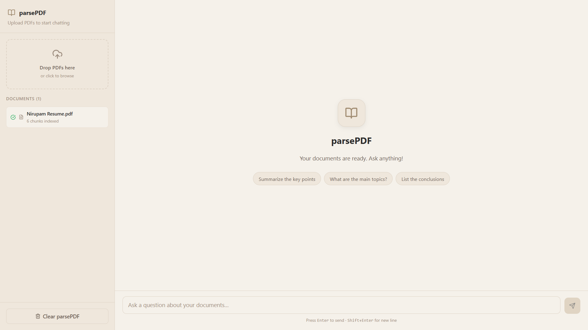
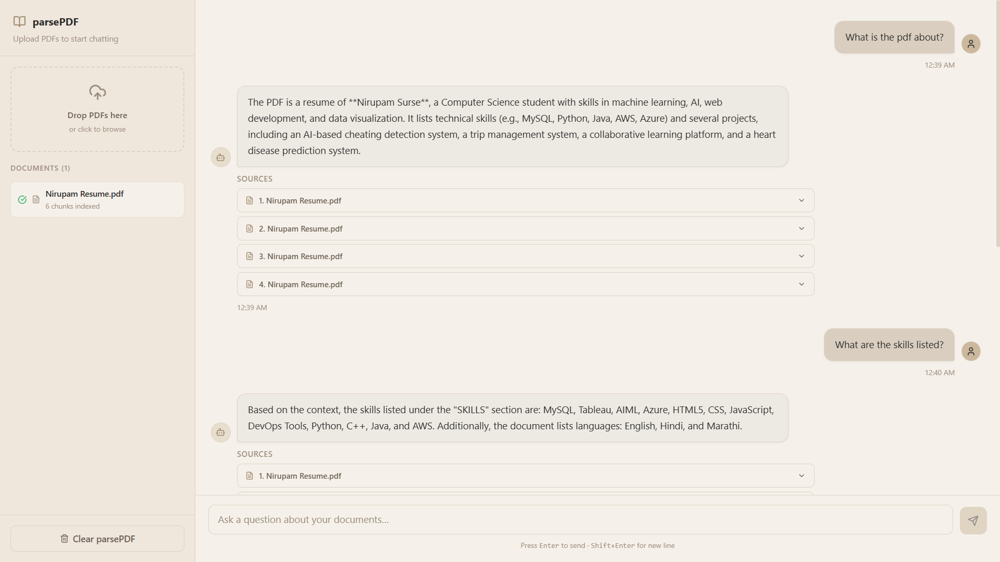
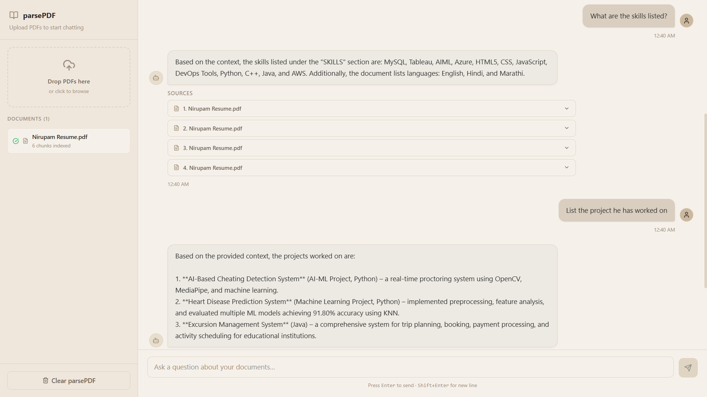

# parsePDF - AI Knowledge Base

parsePDF is an AI-powered, Retrieval-Augmented Generation (RAG) knowledge base. It allows users to upload PDF documents, automatically extracts and processes the text, and provides a conversational interface to query the contents of those documents. The AI answers questions using natural language, strictly referencing the uploaded material, and provides exact source citations for its answers.
## 📸 Screenshots

### Landing Page


### Upload & Chat


### AI Responses & Citations


## 🏗️ Architecture

```text
                      +-------------------+
                      |   USER INTERFACE  |
                      |  (React + Vite)   |
                      +---------+---------+
                                |
                   POST /upload | POST /chat
                                |
                      +---------v---------+
                      |    FASTAPI APP    |
                      |  (Backend Server) |
                      +---------+---------+
                                |
          +---------------------+---------------------+
          |                     |                     |
  [INGESTION PIPELINE]          |           [INFERENCE PIPELINE]
          |                     |                     |
  +-------v-------+             |             +-------v-------+
  |  PyPDF Loader |             |             | Embed Query   |
  +-------+-------+             |             +-------+-------+
          |                     |                     |
  +-------v-------+             |             +-------v-------+
  | Text Splitter |             |             | LangChain     |
  +-------+-------+             |             | Prompt Builder|
          |                     |             +-------+-------+
  +-------v-------+             |                     |
  | Embeddings    |             |                     |
  | (MiniLM)      |             |                     |
  +-------+-------+             |                     |
          |                     |                     |
          |           +---------v---------+           |
          +---------> |   FAISS VECTOR    | <---------+
                      |     DATABASE      |
                      +-------------------+

                                |
                                | (API Call)
                                v
                      +-------------------+
                      |    OPENROUTER     |
                      |  (Mistral/Llama3) |
                      +-------------------+
```

### Architecture Components:
- **Frontend:** Built with React and Vite. Manages UI and global state using Zustand.
- **Backend:** FastAPI server handling file uploads and chat queries.
- **Ingestion:** Extracts text from PDFs using `PyPDF`, splits it into chunks, generates vector embeddings using SentenceTransformers, and stores them in FAISS.
- **Inference:** Embeds user queries, retrieves relevant chunks from FAISS, builds a grounded prompt via LangChain, and sends it to the OpenRouter API to generate a factual response.

## 📦 Dependencies & Tech Stack

### Frontend
- **Framework:** React 19 + TypeScript
- **Build Tool:** Vite
- **Styling:** Tailwind CSS 4, Lucide React (Icons)
- **State Management:** Zustand
- **HTTP Client:** Axios

### Backend
- **Framework:** FastAPI, Uvicorn
- **AI/RAG Orchestration:** LangChain
- **Vector Database:** FAISS (faiss-cpu)
- **Embeddings:** Sentence-Transformers (`all-MiniLM-L6-v2`)
- **PDF Parsing:** pypdf
- **LLM Client:** OpenAI Python SDK (configured for OpenRouter)
- **Other utilities:** python-dotenv, httpx, pydantic, python-multipart

## 📂 Project Structure

```text
.
├── backend/
│   ├── app/
│   │   ├── routes/          # API endpoints (upload.py, chat.py)
│   │   ├── utils/           # RAG logic (rag_pipeline.py, vector_store.py, etc.)
│   │   └── main.py          # FastAPI application entry point
│   ├── uploaded_pdfs/       # Storage for ingested documents
│   ├── vector_store/        # Local FAISS database files
│   ├── requirements.txt     # Python dependencies
│   └── .env                 # Environment variables
├── frontend/
│   ├── src/
│   │   ├── components/      # React components (Sidebar.tsx, ChatWindow.tsx)
│   │   ├── services/        # API integration (api.ts)
│   │   ├── store/           # Zustand state (chatStore.ts)
│   │   └── index.css        # Tailwind styles
│   ├── package.json         # Node dependencies
│   └── vite.config.ts       # Vite configuration
└── README.md
```

## 🚀 How to Run Locally

Follow these instructions to run the application on your local machine.

### 1. Prerequisites
- **Node.js** (v18+)
- **Python** (3.10+)
- **OpenRouter API Key** (for LLM inference)

### 2. Backend Setup
Navigate to the backend directory, create a virtual environment, and install dependencies:

```bash
cd backend

# Create and activate virtual environment
python -m venv venv

# Windows
.\venv\Scripts\activate
# Mac/Linux
source venv/bin/activate

# Install dependencies
pip install -r requirements.txt

# Create .env file and add your OpenRouter API key
# Example: OPENROUTER_API_KEY=your_key_here
cp .env.example .env

# Run the FastAPI server
python -m uvicorn app.main:app --reload
```
The backend will run on `http://localhost:8000`. API documentation is available at `http://localhost:8000/docs`.

### 3. Frontend Setup
Open a new terminal, navigate to the frontend directory, and install dependencies:

```bash
cd frontend

# Install dependencies
npm install

# Run the development server
npm run dev
```
The frontend will run on `http://localhost:5173`. Open this URL in your browser to start using parsePDF!
